# 蘑菇街

[toc]

# 支付系统1.x

- 业务简单、玩法单一

- 快速支撑系统

- 实现核心功能

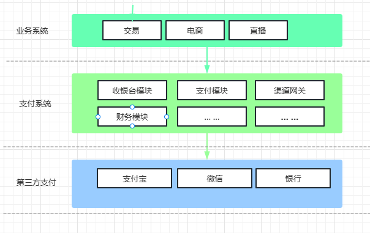

## 业务问题

- 烟囱结构，难扩展
- 业务野蛮生长，无模型抽象
- 业务边界模糊，耦合严重

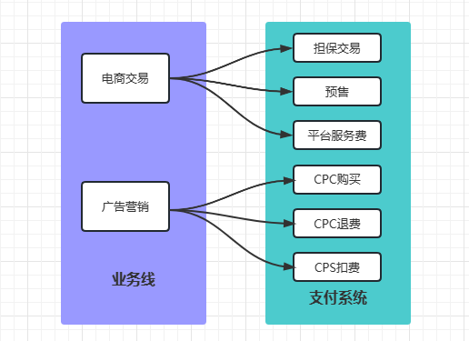

## 系统问题

- 巨大臃肿单体应用

- 系统间严重耦合

- 弱稳定性

- 单点性能瓶颈

  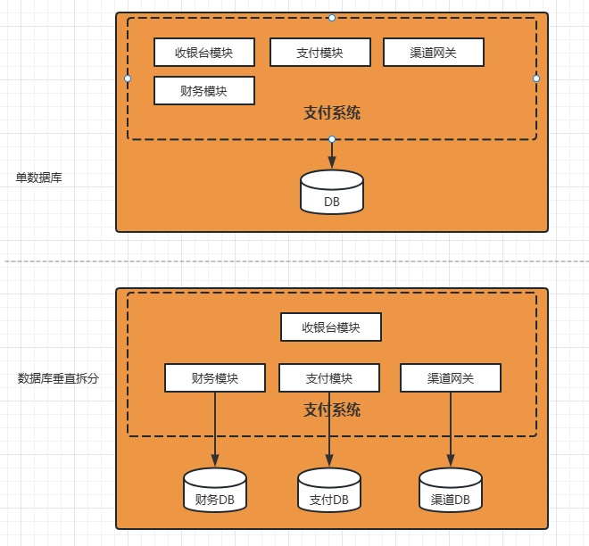

  

## 资金问题

- 支付接入无授权
- 各项业务收入、支出难核算
- 数据一致性挑战


# 支付系统2.0架构实践

## 如何做？

- 系统拆分、服务化
  - 确定边界、业务建模
  - 沉淀基础服务
- 构建资金核算体系
- 业务、场景、技术划分边界
- 核心子系统划分为：
  - 收银台、交易核心、支付核心、网关
  - 账务、会计、清算、合规

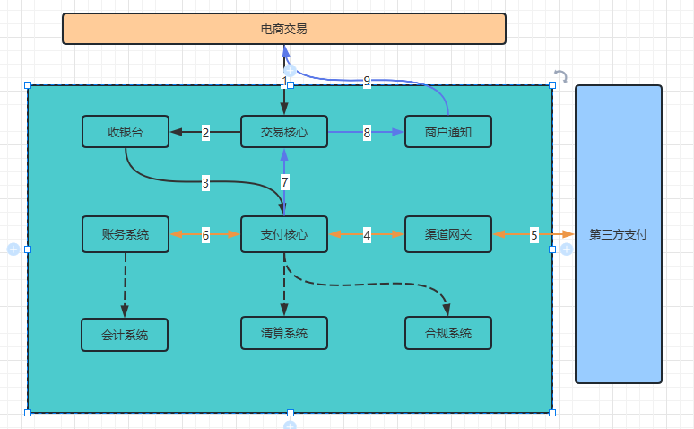

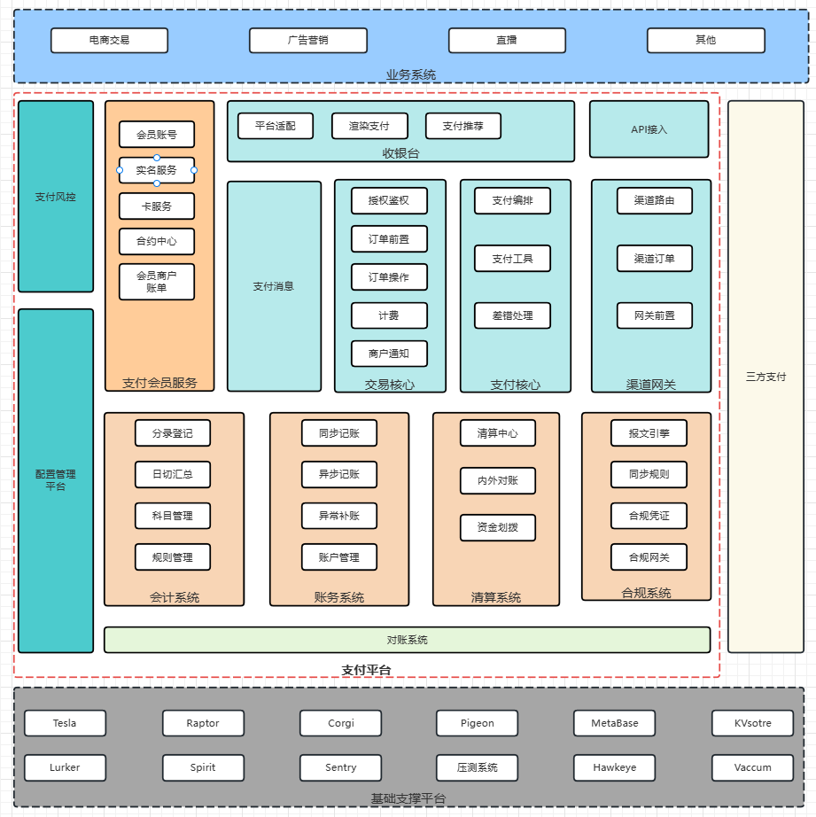


### 交易核心

- 抽象基础交易类型
- 多表聚合
- 订单关联
- 授权鉴权

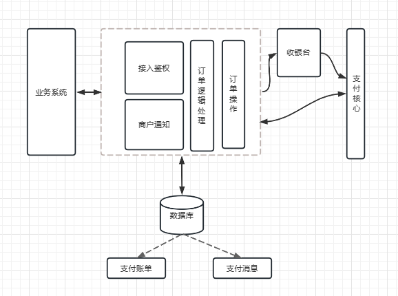


### 基础交易类型抽象

- 抽象基础交易类型
  - 担保交易
  - 即时交易
  - 充值、提现
  - 退款、转账

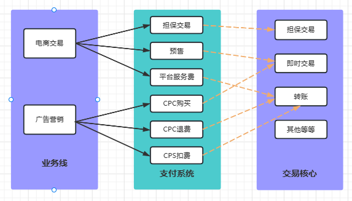

### 多表聚合+订单关联

- 订单唯一约束
- 任何订单可追溯初始单

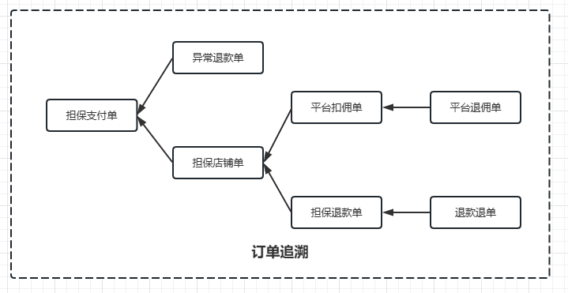


### 支付接入管控

- 基于业务接入分配的业务标识码，添加授权入口，分配token。
- 业务系统请求支付，带token进入，鉴权。


### 支付核心

- 抽象4种支付类型

  - 充值、提现、退款、转账

- 支付工具组件化

  - 抽象数十种支付工具

- 支付编排

  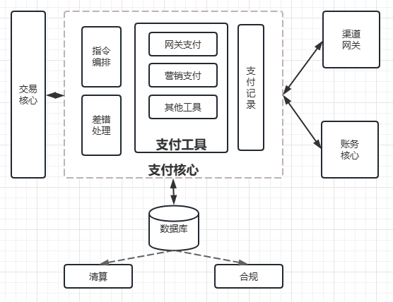


### 支付编排

- 插件式开发

- 规则可配置化

  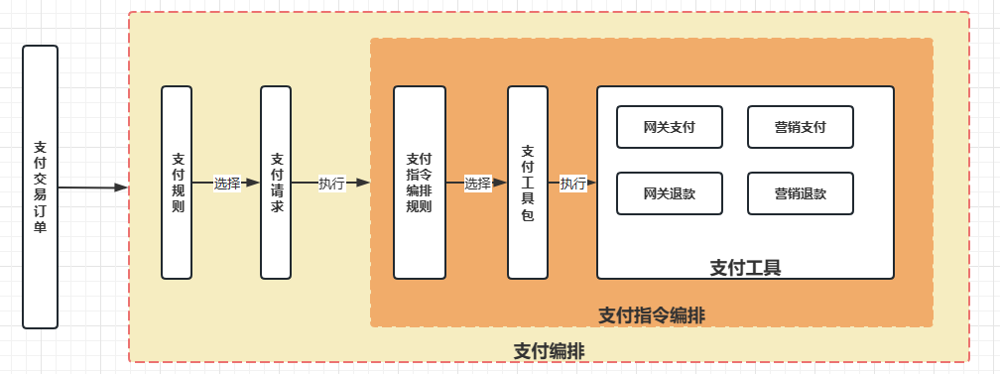


### 异常处理机制

- 支付异常分类
  - 重复支付
  - 部分支付
  - 金额不一致
  - 其他异常全额退款

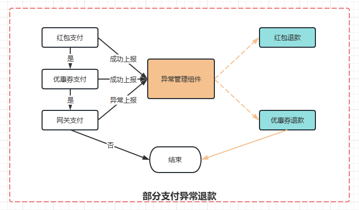


### 渠道网关

- 网关服务抽象
  - 支付、退款、提现、
  - 签约、查询
- 网关核心、网关前置

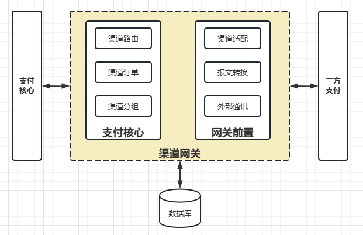


### 资金核算体系

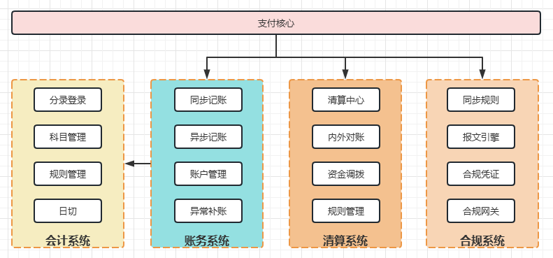


### 平台统一上下文

- 唯一业务标识码(四要素),链路传递
  - merchantId(商户)
  - orderType(订单类型)
  - subType(订单场景)
  - payOrgNo(支付机构)


### 数据一致性挑战

- CAS
- 幂等&异常补偿
- 对账

#### CAS

- 交易核心、支付核心通过状态CAS防止并发
  - ``` update PayOrder set status='complete' where id=1 and status='process' ```
- 基于KVstore的分布式缓存锁
  - 解决重复支付问题

#### 幂等&异常补偿

- 全链路接口保持幂等
- 超时、网络异常等问题
  - 基于Corgi准实时补偿
  - 异常表补偿

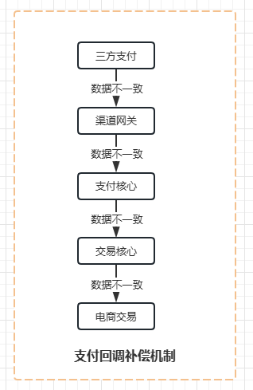


#### 对账

- 对账是数据一致性最后一道防护
- 内部精力准实时对账
- T+1基于账单，内外对账

#### 准实时对账

- 支持多数据源
- 低延时

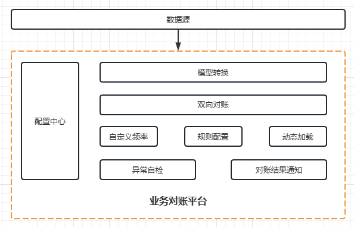

#### 效果

- 快速支撑业务
- 16年快速融合淘世界、美丽说支付系统
- 业务细分，来源管控
- 准确的资金核算，各业务资金情况清晰明了
- 解决资金监管问题


## 支付平台性能提升

### 性能提升

- 核心链路分库分表：全链路水平扩展
- 服务调用异步化
- 热点账户问题优化
- 事务切分


### DB水平拆分

- 核心链路为例
- DB基于Raptor分库分表
- 全局ID唯一

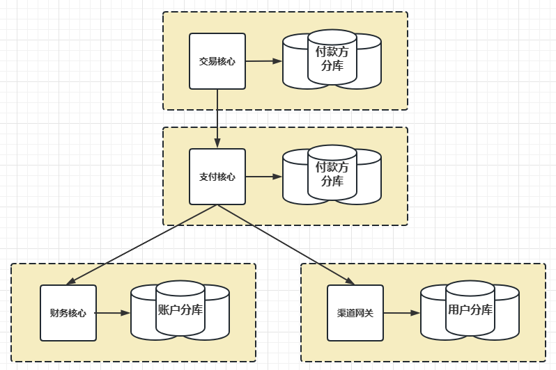


### 异步化

- 拆分&服务化带来更多系统依赖，异步化是最好的解耦方式
- 支付核心链路非实时业务，可以异步化处理
- 异步化有益于提升链路性能


### 支付消息

- 基于支付交易核心订单数据
- 解耦、简化业务方数据获取

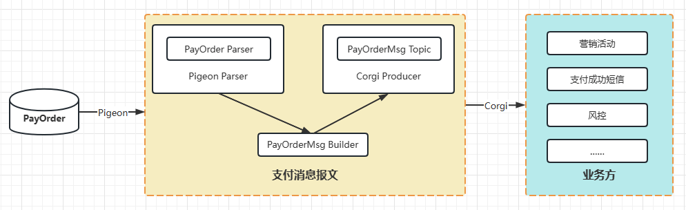


### 外部支付异步化

#### 一

- 同步获取三方支付凭证
- 跨外部网络
- max RT >1s
- 支付链路整体阻塞

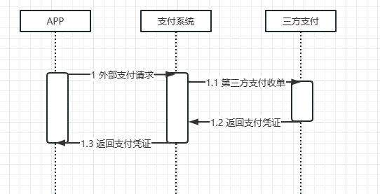


#### 二

- 异步获取
- 独立渠道前置
- avg RT 200->5ms

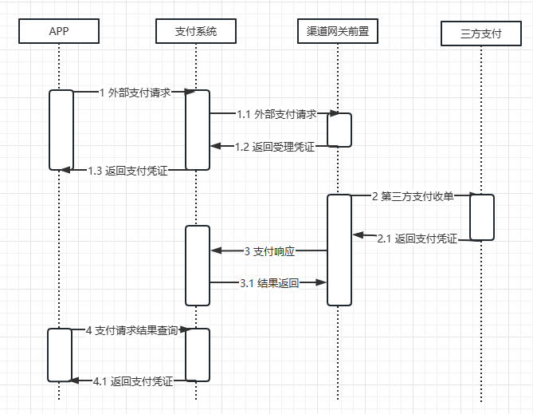


### 异步并行

- 支付核心链路多为IO密集型
- 利用Tesla框架异步服务调用
- 取决于最长的请求IO时间

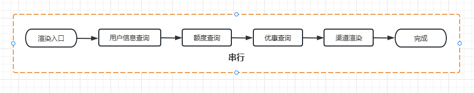

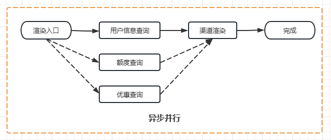


### 资金核算体系异步化

- 数据异步准实时同步
- pigeon(数据变更事件中间件)
- 实时链路解耦

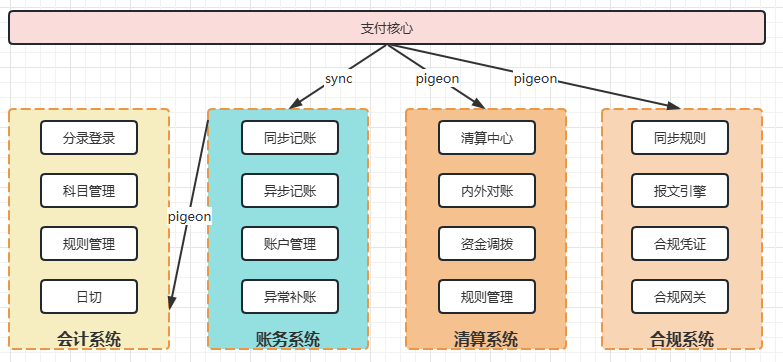


### 账务-热点账户

- 单边记账
  - 内部户，账务不记账，会计补分录
- 异步记账
  - 平台户异步记账，定时汇总记账
- 二级子账户

### 账务-记账事务切分

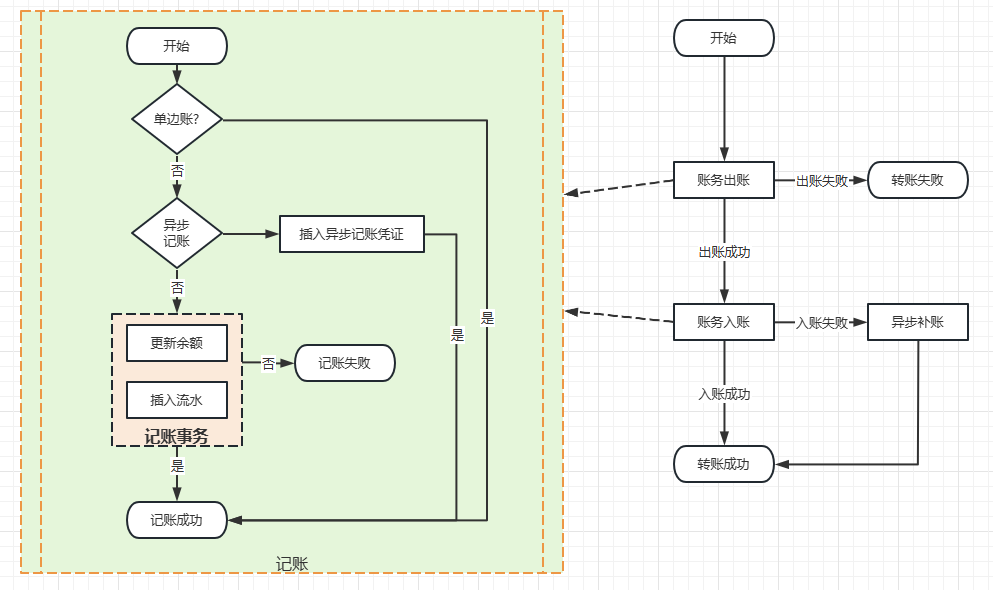


### 性能压测

- 构建压测模型，模拟线上真实场景
- 压测数据进影子库，正常业务无侵入
- 单机性能压测，集群链路压测
- 识别系统稳定性、容量配比等

### 效果

- 链路DB扩容为2台物理机器，支付稳定3000QPS。理论值可达1wQPS以上
- 应用服务器利用率，只需原有机器的1/3
- 链路性能


## 支付平台稳定性提升

### 稳定性提升

- 监控先行，关键指标管控
- 核心链路剥离
- 服务依赖治理
- 限流、降级


### 核心链路分离

- 电商平台特性
- 剥离核心链路
- 核心支付链路
- 通用支付服务

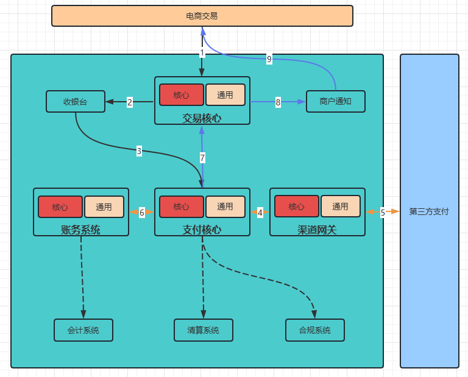

### 服务依赖

- 梳理支付平台内强弱依赖，特别针对于核心下单链路
- 弱依赖做好降级开关
- 强依赖服务做好SLA保障


### 限流、降级

- 限流是保护系统不挂的最后一道防线
- 基于Tesla服务框架限流
- 基于spirit细粒度限流降级系统


## 总结与展望

- 支付体系上层业务面向电商特色
  - 性能容量找寻一切可改进点
  - 支付系统稳定性为先
- 支付平台配置统一化


[支付体系架构与实践.pdf (book118.com)](https://max.book118.com/html/2019/0526/7141023045002030.shtm)

[一个细节翔实、可供参考的支付体系架构演进实例 (sohu.com)](https://www.sohu.com/a/161599299_355140)

[支付系统 - 支付整体架构设计 - 掘金 (juejin.cn)](https://juejin.cn/post/6844904198811680782)

[架构系列：蘑菇街的支付系统2.0架构演进 - 掘金 (juejin.cn)](https://juejin.cn/post/6844903906841985032)

https://mp.weixin.qq.com/s/83sdYwCw3Q_HT_AFxqdcHw

